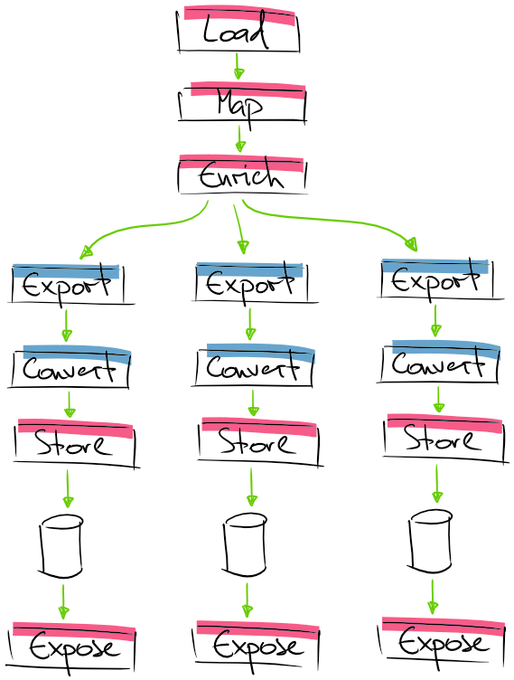

# Geta Optimizely Product Feed

## Status

,branch:master/statusIcon)
[](https://sonarcloud.io/summary/new_code?id=Geta_geta-optimizely-productfeed)
[](https://docs.microsoft.com/en-us/dotnet/)
[](http://world.episerver.com/cms/)
[](http://world.episerver.com/commerce/)

Credits: [How to make a Google Shopping Feed with C# and serve it through the Web API](http://blog.codenamed.nl/2015/05/14/creating-a-google-shopping-feed-with-c/).

Add-on will create a Google Product Feed based on the [Atom specification](https://support.google.com/merchants/answer/160593?hl=en). For information on what is required and what the different attributes/properties mean, please see the [Product data specification](https://support.google.com/merchants/answer/188494).

## Installation

```
> dotnet add package Geta.Optimizely.ProductFeed
> dotnet add package Geta.Optimizely.ProductFeed.Google

# and/or

> dotnet add package Geta.Optimizely.ProductFeed.Csv
```

## Configuration

For the `ProductFeed` package to work, you have to call `AddProductFeed<T>()` and `AddGoogleXmlExport()` extension methods in `Startup.ConfigureServices` method. Using configuration options parameter of this method, you can provide a DB connection string and other setup information.

```csharp
services
    .AddProductFeed<MyCommerceProductRecord>(x =>
    {
        x.ConnectionString = _configuration.GetConnectionString("EPiServerDB");
        x.SetEntityMapper<EntityMapper>();
    });
```

Here `MyCommerceProductRecord` is an entity to which a generic CatalogContentBase objects will be mapped to.

## Processing Pipeline

During the processing pipeline there are a few key moments to be aware of (you can override any of these mentioned below):

* Catalog Data **Load** - loads data from the Optimizely Commerce catalog.
* Catalog Data **Map** - loaded data usually comes in `CatalogContentBase` shape. This step allows mapping to `T` data type (mentioned in `AddProductFeed<T>()` method).
* Entity **Filters** - filters are deciding whether entity should be included in the processing pipeline or filtered out.
* **Enrichments** - When loaded data is mapped to a custom entity, the processing pipeline can start the work. Enrichments are responsible for loading some heavy data and adding necessary metadata to the `T` entity.
* Feed **Exporters** - exporters are responsible for generating feed content in a specific format and using specific feed entities.
* Feed **Filters** - filters are responsible for deciding whether specific entity should be included in the feed.
* Feed entity **Converter** - converters are responsible for taking the projected entity (`T` mentioned in `AddProductFeed()`) and return a feed entity which will be used to store the actual product feed in the underlying storage.
* **Storage** Providers - right now we only have MSSQL storage implementation. But should be quite easy to implement the next one.



### Adding Google Xml Export

Following code adds Google Xml product feed functionality to your site:

```
services
    .AddProductFeed<MyCommerceProductRecord>(options =>
    {
        options.ConnectionString = _configuration.GetConnectionString("EPiServerDB");
        options.SetEntityMapper<EntityMapper>();

        options.SetFilter<GenericEntityFilter>();
        options.AddEnricher<FashionProductAvailabilityEnricher>();

        options.AddGoogleXmlExport(d =>
        {
            d.FileName = "/google-feed";
            d.SetFilter<GoogleXmlFilter>();
            d.SetConverter<GoogleXmlConverter>();
        });
    });
```

Few notes:

* Loaded commerce catalog data will be mapped to `MyCommerceProductRecord` class.
* `EntityMapper` will be used to do this mapping.
* `FashionProductAvailabilityEnricher` will be used to process each `MyCommerceProductRecord` and set SKU availability by some criteria.
* `GoogleXmlFilter` filter will be used for each entity to decide whether particular entity should be included in the feed.
* Google Xml product feed entities will be generated using `GoogleXmlConverter` class.
* Feed data will be stored in MSSQL database under `"EPiServerDB"` connection string.
* Google Xml product feed will be mounted to `/google-feed` URL.

Custom mapped entity class (`MyCommerceProductRecord.cs`):

```csharp
public class MyCommerceProductRecord
{
    public string Code { get; set; }
    public string DisplayName { get; set; }
    public string Description { get; set; }
    public string Url { get; set; }
    public string Brand { get; set; }
    public string ImageLink { get; set; }
    public bool IsAvailable { get; set; }
}
```

Custom entity mapper (`EntityMapper.cs`):

```csharp
public class EntityMapper : IEntityMapper<MyCommerceProductRecord>
{
    public MyCommerceProductRecord Map(CatalogContentBase catalogConte
    {
        return ...
    }
}
```

Generic converted entity filter (`GenericEntityFilter.cs`):

```csharp
public class GenericEntityFilter : IProductFeedFilter<MyCommerceProductRecord>
{
    public bool ShouldInclude(MyCommerceProductRecord entity)
    {
        // filter out ALL entities from the feed
        return false;
    }
}
```

Enricher (`FashionProductAvailabilityEnricher.cs`):

```csharp
public class FashionProductAvailabilityEnricher :
    IProductFeedContentEnricher<MyCommerceProductRecord>
{
    public MyCommerceProductRecord Enrich(
        MyCommerceProductRecord sourceData,
        CancellationToken cancellationToken)
    {
        // enrich SKU availability
    }
}
```

Google Xml feed filter (`GoogleXmlFilter.cs`):

```csharp
public class GoogleXmlFilter : IProductFeedFilter<MyCommerceProductRecord>
{
    public bool ShouldInclude(MyCommerceProductRecord entity)
    {
        return true;
    }
}
```

Google Xml feed entity converter (`GoogleXmlConverter.cs`):

```csharp
public class GoogleXmlConverter : IProductFeedConverter<MyCommerceProductRecord>
{
    public object Convert(MyCommerceProductRecord entity)
    {
        return new Geta.Optimizely.ProductFeed.Google.Models.Entry
        {
            // set properties for feed entity
        }
    }
}
```

### Adding CSV Export

Adding CSV export is quite easy as well.

Then add somewhat similar code to your `Startup.cs` file:

```csharp
services
    .AddProductFeed<MyCommerceProductRecord>(options =>
    {
        options.ConnectionString = _configuration.GetConnectionString("EPiServerDB");
        options.SetEntityMapper<EntityMapper>();

        options.AddEnricher<FashionProductAvailabilityEnricher>();

        options.AddCsvExport(d =>
        {
            d.FileName = "/csv-feed-1";
            d.SetConverter<CsvConverter>();
            d.CsvEntityType = typeof(CsvEntry);
        });
    });
```

All processing pipeline logic is the same as for the Google Xml feed except following changes:

* CSV product feed entity is set to `CsvEntity`.
* Feed entity is converted via `CsvConverter`.
* Feed is mounted to `/csv-feed-1` route.

Custom CSV entity (`CsvEntity.cs`):

```csahrp
public class CsvEntry
{
    public string Name { get; set; }
    public string Code { get; set; }
    public decimal Price { get; set; }
    public bool IsAvailable { get; set; }
}
```

CSV converter (`CsvConverter.cs`):

```csharp
public class CsvConverter : IProductFeedConverter<MyCommerceProductRecord>
{
    public object Convert(MyCommerceProductRecord entity)
    {
        return new CsvEntry
        {
            // set properties for the entity
        };
    }
}
```

CSV feed will have a header row generated out-of-the-box based on properties in `CsvEntity` class.

## Feed Generation

Populating the feed is handled through a scheduled job and the result is serialized and stored in the database. See job `ProductFeed - Create feeds` in the Optimizely Admin mode.

## Troubleshooting

If your request to `/googleproductfeed` (or any other path that you configured for the feed) returns 404 with message `No feed generated`, make sure you run the job to populate the feed.

## Local development setup

See description in [shared repository](https://github.com/Geta/package-shared/blob/master/README.md#local-development-set-up) regarding how to setup local development environment.

### Docker hostnames

Instead of using the static IP addresses the following hostnames can be used out-of-the-box.

http://googleproductfeed.getalocaltest.me
http://manager-googleproductfeed.getalocaltest.me


## Package maintainer

https://github.com/valdisiljuconoks

## Changelog

[Changelog](CHANGELOG.md)
